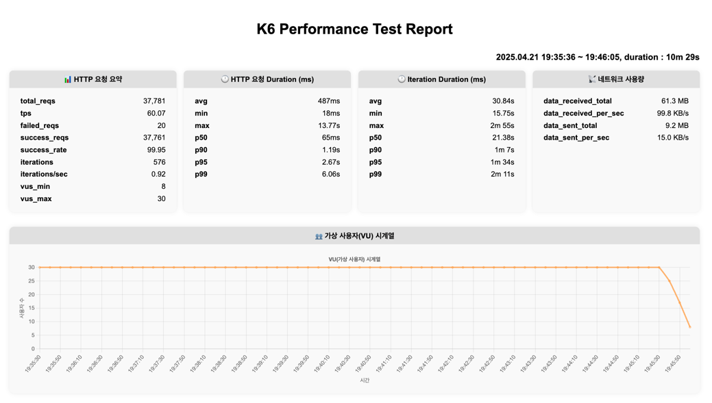
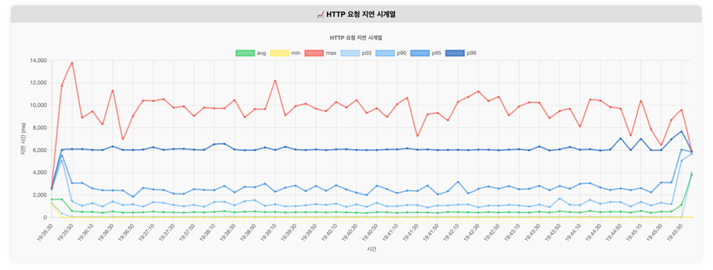
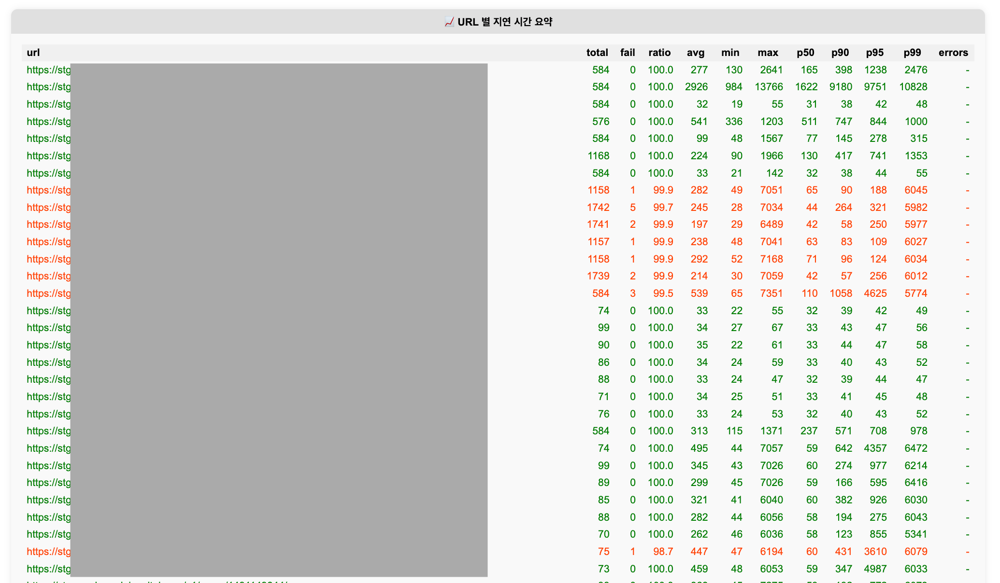
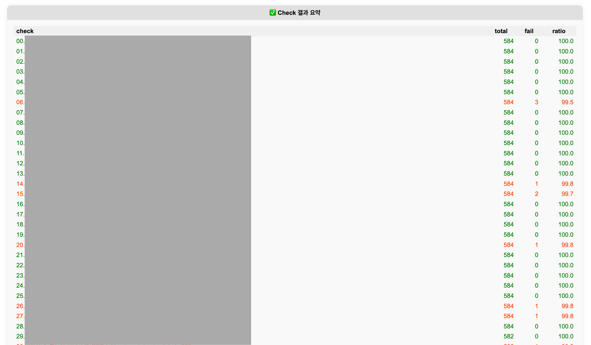

## K6 Load Test Report Generator

k6 부하 테스트 결과 CSV 파일을 입력받아,
- HTML 리포트 생성
- Console 요약 출력
- CSV 요약 파일 생성

을 자동으로 수행합니다.

---

## 실행 방법

```bash
  python reporter/main.py k6/out/your-k6-result.csv
```

## 실행 결과
- reporter/out/ 폴더 아래에
- HTML 리포트 파일 (.html)
- URL별 상세 테이블 CSV (_detail_table.csv)
- Check별 상세 테이블 CSV (_detail_check_table.csv) 가 생성됩니다.
- Console에는 주요 요약만 깔끔하게 출력됩니다.

## 예시




